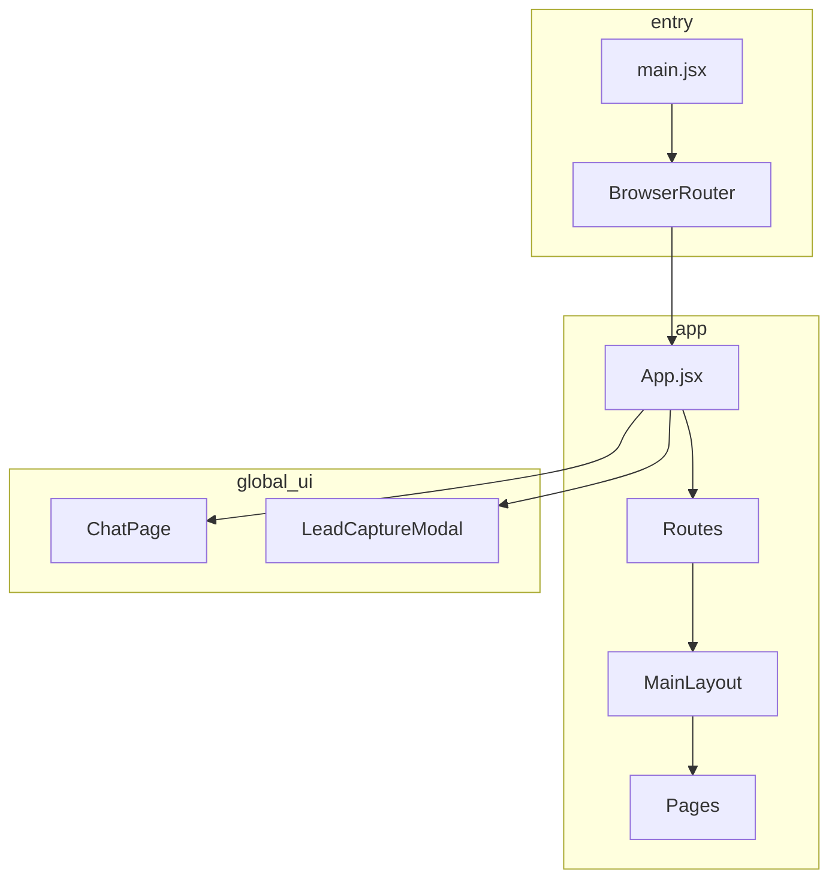

# Labsoy Site


Public marketing and product experience for **Labsoy Technologies**—home, services, portfolio, about, and contact—with bilingual content (English / Turkish), an interactive hero, optional AI chat, and a lead-capture flow.

## Purpose

This repository is the front-end for the Labsoy corporate website. It delivers a fast, accessible SPA with routed pages, internationalization, rich media (including a WebGL-based hero sequence), and integrations such as mail-driven lead capture and an optional local LLM chat client.

## Tech Stack

### Core

| Area | Technology |
|------|--------------|
| UI | React 18, React Router 6 |
| Build | Vite 6, `@vitejs/plugin-react` |
| Language | JavaScript (JSX); TypeScript available for tooling / server-adjacent code |
| i18n | i18next, react-i18next |

### Experience & UI

| Area | Technology |
|------|--------------|
| 3D / motion | three.js, GSAP |
| Dialogs & primitives | Radix UI (`@radix-ui/react-dialog`, and related packages) |
| Styling | Modular CSS (design tokens, page and component stylesheets) |
| Icons | react-icons, lucide-react |

### Data & quality

| Area | Technology |
|------|--------------|
| Forms / validation | Zod, react-hook-form (where used) |
| Testing | Vitest, Testing Library, jsdom |
| Optional backend-style deps | Express, Drizzle, Neon client (present for extended / server workflows) |

## Architecture overview



### Routes

| Path | Page |
|------|------|
| `/` | Home |
| `/about` | About |
| `/services` | Services |
| `/portfolio` | Portfolio |
| `/contact` | Contact |

Global overlays: **Chat** (AI assistant UI) and **Lead capture** (scheduled modal; skipped on `/contact` after successful submit cooldown).

## Quick start

```bash
npm install
npm run dev
```

Development server defaults to Vite’s local URL (typically `http://localhost:5173`).

### Production build

```bash
npm run build
npm run preview
```

## GitHub Pages

Deployments run from [`.github/workflows/github-pages.yml`](.github/workflows/github-pages.yml) on every push to `master` (and manual **Run workflow**).

### One-time repository settings

1. GitHub → **Settings** → **Pages** → **Build and deployment** → Source: **GitHub Actions**.
2. After the first successful run, the site URL appears under **Pages** (for this org/repo pattern: `https://labsoy.github.io/labsoy-site/`).

### Base path

- **Default:** the workflow sets `VITE_BASE_PATH` to `/` (root), which is correct for custom-domain hosting such as `https://labsoy.com` / `https://www.labsoy.com`.
- **Optional override:** set repository variable `PAGES_BASE_PATH` only if you intentionally deploy under a subpath.
- Set repository variable `VITE_PUBLIC_SITE_URL` (for example `https://www.labsoy.com`) so canonical/Open Graph URLs use the correct origin.

`public/.nojekyll` is included so GitHub Pages does not ignore paths that look like Jekyll reserves.

### Local check with root base

```bash
set VITE_BASE_PATH=/
npm run build
npm run preview
```

(PowerShell: `$env:VITE_BASE_PATH="/"; npm run build`)

## Scripts

| Command | Description |
|---------|-------------|
| `npm run dev` / `npm start` | Start Vite dev server |
| `npm run build` | Production build to `dist/` (`VITE_BASE_PATH` optional; defaults to `/`) |
| `npm run preview` | Serve the production build locally |
| `npm test` | Run Vitest once |
| `npm run test:watch` | Vitest in watch mode |

## Environment variables

Variables consumed by the app must be prefixed with `VITE_` to be exposed to the client.

| Variable | Purpose |
|----------|---------|
| `VITE_OLLAMA_API_URL` | Base URL for a compatible Ollama HTTP API (e.g. `http://127.0.0.1:11434`) |
| `VITE_OLLAMA_MODEL` | Model name passed to the chat API |
| `VITE_BASE_PATH` | Vite `base`; default `/` in the workflow |
| `VITE_PUBLIC_SITE_URL` | Optional canonical site origin (no trailing slash), e.g. `https://labsoy.com` for production SEO |

If these are unset, AI chat features that depend on them will not work until configured. Create a `.env` file in the project root (gitignored) and define the variables there.

## Project structure

```
labsoy-site/
├── public/
├── src/
│   ├── App.jsx
│   ├── main.jsx
│   ├── component/       # Reusable UI (home sections, lead modal, etc.)
│   ├── layout/          # Shell layout (header, footer wiring)
│   ├── pages/           # Route-level pages
│   ├── styles/          # Global and scoped CSS
│   ├── i18n/            # i18next configuration and locales
│   ├── services/        # e.g. AI client helpers
│   ├── utils/           # Shared helpers
│   └── test/            # Vitest setup and tests
├── vite.config.js
└── package.json
```

## Testing

Tests run in Node with `jsdom` and shared setup in `src/test/setupTests.js`.

```bash
npm test
```

## Requirements

- **Node.js** 18+ recommended (align with Vite 6 and toolchain in use)
- **npm** (lockfile: `package-lock.json`)

## Authors

Serhat Soysal — Labsoy Technologies
